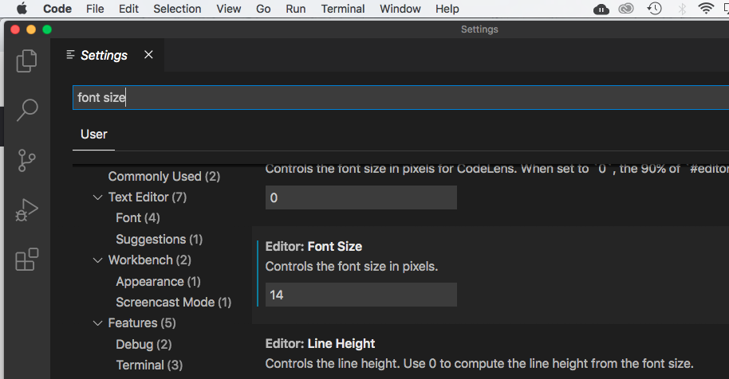
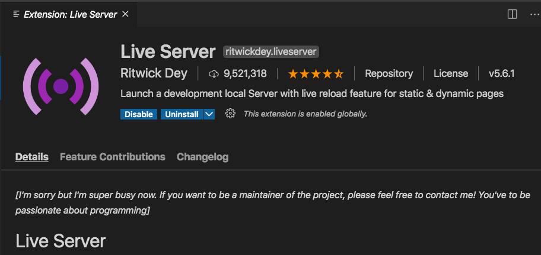
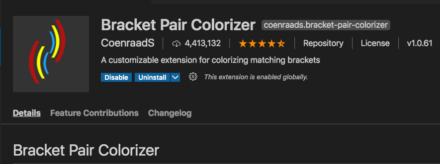
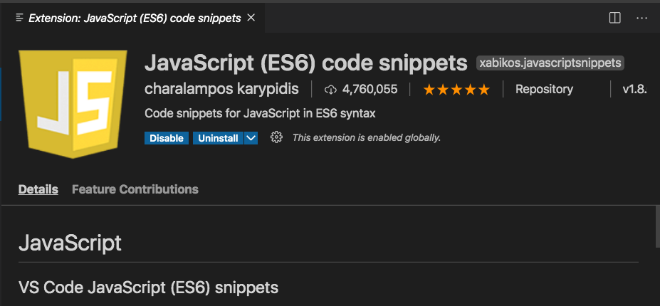
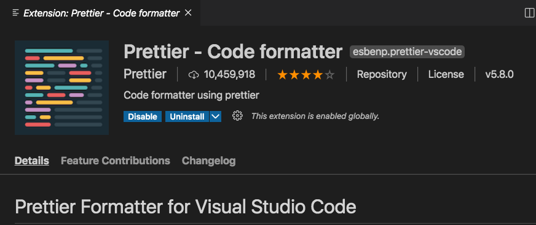

# Belajar Fundamental JavaScript 

## Visual Studio Setup

#### Download Visual Studio Code

Link download: code.visualstudio.com/download

#### Setup

* Klik File > Preferences > Settings
	* Search: font size > isi ukuran font sesuai dengan keinginan anda, kalau saya: 14.
	
	* Search: tab size > isi ukuran tab sesuai dengan keinginan anda, kalau saya: 4
	
	* Search: word wrap > tentukan on atau off, kalau saya: on.
	
* Install Extention
	* Live Server, by Ritwick Dey.
	
	  
	
	  
	
	  
	
	* Bracket Pair Colorizer, by CoenraadS
	
	  
	
	  
	
	* Javascript (es6) code snippets, by Charalampos karypidis.
	
	  
	
	  
	
	* Prettier Code Formatter, by Prettier. 	  

---

### Mediocademy

---

### Copyright MedioCademy

